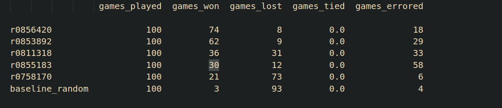

## tournament 

we lost...

-> aanpassing nog te doen: vervang eval_functie met MCTS rollout functie. 
-> MCTS + deepRL ? enkel MCTS ?
-> MCTS zo snel mogelijk afwerken!!

-> we overschrijden de 200ms time mark met minimax. 
note: dit was de versie met enkel de standaard transposition table en domme eval_functie. 

### stap 0

- checken of huidige implementatie van minimax correct doet wat het moet doen. 
- print de game tree
- timing measures, waar verliezen we het meeste tijd. 

### stap 1

- symmetrie en chains moet nog toegevoegd worden. 

### stap 2

- MCTS toevoegen

### stap 3

- deepRL indien tijd over
- code scrhijven voor verslag van task 3 en 4. 