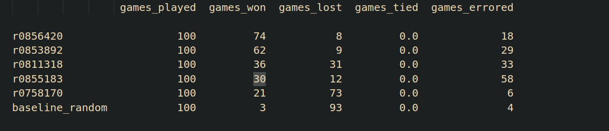

## info :

https://stanford-cs221.github.io/autumn2023-extra/modules/games/evaluation-functions-6pp.pdf

intresting proposition: if next player to play is the same player, 
(due to capture of box), do not decrease the depth in

https://ics.uci.edu/~rickl/courses/cs-171/0-ihler-2016-fq/Lectures/Lathrop/cs-171-07a-Games-MiniMax.pdf

behaviour is preserved under any *monotonic* transformation of eval_function. 
Board evaluation X for player is -X for opponent
– “Zero-sum game” (i.e., scores sum to a constant)

## tournament 

we lost...

-> aanpassing nog te doen: vervang eval_functie met MCTS rollout functie. 
-> MCTS + deepRL ? enkel MCTS ?
-> MCTS zo snel mogelijk afwerken!!

-> we overschrijden de 200ms time mark met minimax. 
note: dit was de versie met enkel de standaard transposition table en domme eval_functie. 

### stap 0

- checken of huidige implementatie van minimax correct doet wat het moet doen. 

- mss de game tree tekenen, kijken of de minimax values wel kloppen. 

>vb.   
>ge begint in intiele state,   
>ge doet minimax,   
>ge doet ideal action  
>ge hebt second state  
>ge doet nogmaals minimax op die second state,  
>moet max speler in de tweede minimax dezelfde zijn als in de eerste minimax, zorgen we ervoor dat da zo is? etc...  

- timing measures, waar verliezen we het meeste tijd. 

### stap 1

- symmetrie en chains moet nog toegevoegd worden. 

### stap 2

- MCTS toevoegen

### stap 3

- deepRL indien tijd over
- code scrhijven voor verslag van task 3 en 4. 